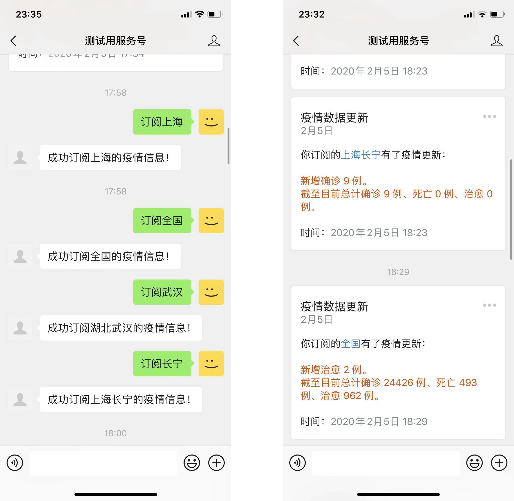

# 微信公众号疫情信息小助手（非官方）

> *疫情信息小助手**个人版本**已完成开发，请参见 [robot-personal](https://github.com/wuhan-support/robot-personal)。*


## 项目目的
该项目还在进行中并且需要您的帮助，我们希望能让所有人都成为传播疫情信息自的媒体。您若赋闲在家并拥有自己的公众号/服务号，不妨传播消息更传播爱。


## 实现功能
1. 通过腾讯提供的数据接口，定时更新数据，存入 `jsons/latest.json`
2. 将数据结构化保存至数据库，方便推送
3. `push_updates.py` 实现服务号的模板消息定制推送服务，配置信息在 `config.py` 中写入
4. `robot_app.py` 实现微信公众号的监听并响应，可以接受用户订阅/取消，可实现实时更新数据的主动推送
5. `db_connect.py` 实现 Redis 和 SQLite 两种数据库统一接口


## 效果演示




## 安装及部署

> 对于没有服务号的用户，可以使用微信公众平台（以下简称“微信”）官方提供的[测试号](https://mp.weixin.qq.com/debug/cgi-bin/sandbox?t=sandbox/login)为主体账号进行安装、部署、测试。

1. 根据微信提供的文档获取你的 `APP_ID`、`APP_SECRET`、`TOKEN` 以及 `ENCODING_AES_KEY`。

2. 新建一个模板消息，并在“模板内容”处输入：
```
你订阅的{{area.DATA}}有了疫情更新：
{{update.DATA}}
时间：{{datetime.DATA}}
```
创建完成后，将获取到的模板 ID 记下。

3. 登录你的服务器（这里以 Linux-based CentOS 7 为例，但适用于几乎任何 UNIX 系统，不适用于 Windows Server）。

4. 下载项目文件并切换工作目录
```shell
git clone https://github.com/wuhan-support/robot-official.git
cd robot-official
```

5. 复制配置模板文件。
```shell
cp robot_official/config_template.py robot_official/config.py
```

6. 打开配置文件 `robot_official/config.py`，将 `APP_ID`、`APP_SECRET`、`TOKEN`、`ENCODING_AES_KEY` 以及模板ID `TEMPLATE_ID` 复制进相应的位置。

7. 将机器人对外暴露。此处给出两种选项：一、暴露配置文件中指定的端口 `ROBOT_PORT`，并将 `ROBOT_HOST` 改为 `0.0.0.0`；二、设置反向代理（Reverse  Proxy），这里给出一个 Nginx 的例子（这只是一个例子，具体实现可由开发者自行研究）：
```nginx
server {
  listen       80;
  server_name  wuhan-wx.domain.com;

  return 301 https://$server_name$request_uri;
}

server {
  listen       443 ssl http2;
  server_name  wuhan-wx.domain.com;

  ssl                        on;
  ssl_certificate            /path/to/cert.pem;
  ssl_certificate_key        /path/to/key.key;
  ssl_session_timeout        10m;
  ssl_ciphers                ECDHE-RSA-AES128-GCM-SHA256:ECDHE:ECDH:AES:HIGH
  ssl_protocols              TLSv1 TLSv1.1 TLSv1.2;
  ssl_prefer_server_ciphers  on;

  location / {
    proxy_pass        http://localhost:8000; # 这里需对应 ROBOT_HOST 及 ROBOT_PORT
    proxy_set_header  Host      $host;
    proxy_set_header  X-Real-IP $remote_addr;
  }
}
```

8. 创建环境（这里以 Conda 为例）并安装依赖：
```shell
conda create -n wuhan python=3.6 werobot redis sqlalchemy requests
source activate wuhan
```

9. 运行机器人：
```shell
nohup python start.py &
```


## 计划
- [x] 与疫情数据接入
- [ ] 其他信息（人工收集，[详情参考](http://feiyan.help)）
- [ ] 其他信息（爬虫收集）
- [ ] 支持公众号（没有模板消息）
